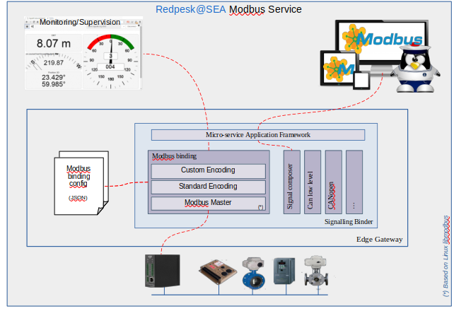

# Architecture presentation

Modbus binding support TCP Modbus with format conversion for multi-register type as int32, Float, ...

* [Installation Guide](./2-installation_guide.html)
* [Running and Testing](./3-configuration.html)
* [Configuration](./4-running_and_testing.html)