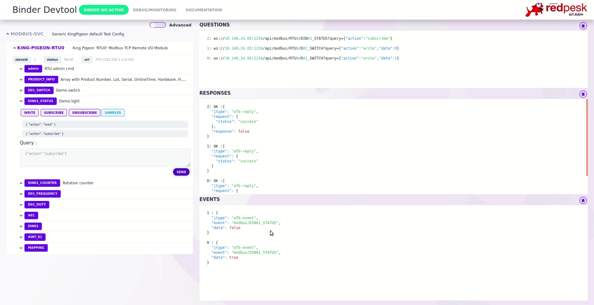

# Running/Testing

By default Kingpigeon devices uses a fix IP addr (192.168.1.110). You may need to add this network to your own desktop config before starting your test. Check hardware documentation on [Device Store / King Pigeon](../../redpesk-marine/devices-store/docs/devices-store/king-pigeon.html)

``` bash
sudo ip a add  192.168.1.1/24 dev eth0 # eth0, enp0s20f0u4u1 or whatever is your ethernet card name
ping 192.168.1.110 # check you can ping your TCP modbus device
check default config with browser at http://192.168.1.110
```

## Start Sample Binder

``` bash
afb-binder --name=afb-kingpigeon --port=1234  --ldpaths=src --workdir=. --verbose
```

open binding UI with browser at `http://localhost:1234/devtools/index.html`



## Test Binder in CLI

``` bash
afb-client --human ws://localhost:1234/api
# you can now send requests with the following syntax : <api> <verb> [eventual data in json format]
# here are some available examples for modbus binding :
modbus ping
modbus info
modbus RTU0/D01_SWITCH {"action":"write","data":1}
modbus RTU0/D01_SWITCH {"action":"read"}
modbus RTU0/D01_SWITCH {"action":"write","data":0}
modbus RTU0/D01_SWITCH {"action":"read"}
```

## Adding your own config

Json config file is selected from *afb-binder --name=afb-midlename-xxx* option. This allows you to switch from one json config to the other without editing any file. *'middlename'* is used to select a specific config. For example *--name='afb-myrtu@lorient-modbus'* will select *modbus-myrtu@lorient-config.json*.

You may also choose to force your config file by exporting CONTROL_CONFIG_PATH environnement variable. For further information, check binding controller documentation [here](../../developer-guides/controllerConfig.html)

**Warning:** some TCP Modbus device as KingPigeon check SalveID even for building I/O. Generic config make the assumption that your slaveID is set to *'1'*.

```bash
export CONTROL_CONFIG_PATH="$HOME/my-modbus-config-directory"
afb-binder --name=afb-myconfig --port=1234  --ldpaths=src --workdir=. --verbose
# connect with your browser on http://localhost:1234/devtools/index.html
```
